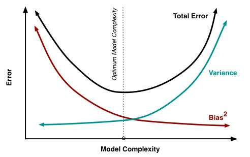
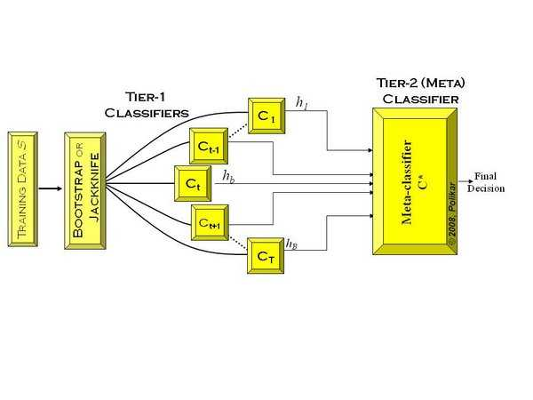

我们的目标是学习一个稳定的模型，但实际情况并不这么理想，有时我们只能得到多个有偏好的模型（弱监督模型，在某些方面表现的比较好）。集成学习就是组合多个弱监督模型以期待得到一个更好更全面的强监督模型。潜在思想是即便某一个弱分类器得到了一个错误的预测，其他的弱分类器也可以将错误纠正回来。

集成学习在各个规模的数据集上都有很好的策略：

* 数据集大：划分成多个小数据集，学习多个模型进行组合
* 数据集小：利用Bootstrap方法进行抽样，得到多个数据集，分别训练多个模型在进行组合。

集成学习主要分为以下三类，**Bagging**, **Boosting**, **Stacking**：

### Bagging

Bagging 是boostrap aggregating的简写，boostrap也称为自助法，它是一种又放回的抽样方法，目的是为了得到统计量的分布以及置信区间。

在Bagging方法中，利用boostrap方法从整体数据集中采取有放回抽样得到N个数据集，在每个数据集上学习一个模型，最后的预测结果利用N个模型的输出得到，具体地： 分类问题采用N个模型预测投票方法，回归问题采用N个模型预测取平均的方式。

### Boosting

Boosting是一种可以用来减小监督学习中偏差的机器学习算法，主要也是学习一系列弱分类器，并将其组合为一个强分类器。Boosting中的代表是：

* AdaBoost(Adaptive boosting)算法：刚开始训练时对每一个训练列赋予相等的权重，然然用该算法对训练集训练T轮，每次训练后，对训练失败的训练列赋予较大的权重，即在每次学习后更加注意学错的样本，从而的到多个预测函数。
* GBDT(Gradient Boost Decision Tree)也是一种Boosting方法，与AdaBoost不同，GBDT每一次的计算是为了减少上一次的残差，GBDT在残差减少（负梯度）的方向上建立一个新的模型。

### Bagging V.S. Boosting

Bagging和Boosting采用的都是**采样-学习-组合**方式，但在细节上有一些不同：

* Bagging中每个训练集互不相关，也就是每个基分类器互不相关，而Boosting中训练集要在上一轮的结果上进行调整，也使得其不能并行计算。
* Bagging中预测函数是均匀平等的，但在Boosting中预测函数是加权的。

算法学习中，通常需要兼顾bias和variance，也就是采取策略使得两者比较平衡。

从算法来看，Bagging关注的是多个基模型的投票组合，保证了模型的稳定，因而每一个基模型就要相对复杂一些，以降低偏差（比如每一颗决策树都很深）

Boostiing采用的策略是在每一次学习中减少上一轮的偏差，因而在保证了偏差的基础上就要将每一个基分类器简化使得方差更小

### Stacking

Stacking方法是指训练一个模型用于组合其他模型，首先训练多个不同的模型，然后把之前训练得到的各个模型的输出作为输入来训练一个模型，以得到一个最终输出。在实际中，我们常常使用LR作为组合策略。

